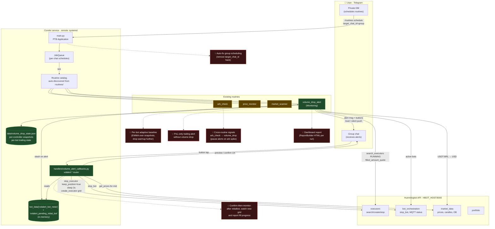

# Condor Alerting & Rebalance Framework

Status snapshot of what we built on top of Condor + Hummingbot API, how the
pieces interact, and where the natural next moves are.

## Architecture



## What we actually built (green)

- **`routines/volume_drop_alert.py`** — polls running executors on schedule,
  time-buckets `filled_amount_quote` into the chosen interval, computes per-bot
  median pace **in USD**, and fires when the latest bucket falls below 20% of
  the median (after warm-up). It also runs a PnL trailing stop per bot
  (activation 0.5%, drawdown 0.3%). Alerts are loud; OK heartbeats are silent.
- **`handlers/volume_alert_callbacks.py`** — routes inline-button taps under the
  `volalert:*` pattern:
  - `ack` / `ackbot` — dismiss
  - `stop` / `stopbot` — stop controller execs / stop a whole bot
  - per-controller rebalance: `rebal` → `rconf` → `rcancel`
  - per-bot rebalance: `rebalbot` → `rconfbot` → `rcancelbot` (stop-then-create
    sequencing, `keep_position=true`, 3 s settle, single grid on the dominant
    controller)
- **State split**
  - Durable JSON (`data/volume_drop_state.json`) — per-controller snapshots,
    per-bot trailing peaks, pace history.
  - In-memory `bot_data` — `volalert_bot_meta` (the controllers / connectors /
    pair / accounts a callback needs) and `volalert_pending_rebal_bot` (the
    spec waiting for confirmation).

## Where the seams are (yellow)

- The other routines (`price_monitor`, `arb_check`, `market_scanner`) are
  isolated — they don't share state with the alert framework yet.
- Group scheduling still relies on the `target_chat_id` workaround: schedule
  from DM, deliver to the group. The upstream Condor bug (job lookup uses
  `chat_id`, instance stored under `user_id`) hasn't been fixed yet.
- `volalert_bot_meta` lives in `bot_data`. A Condor restart between an alert
  and the button tap will surface "no tracked metadata for bot …".

## Natural next steps (red)

1. **Persist `volalert_bot_meta`** to the state file so reboots don't strand
   pending rebalances.
2. **Fix group scheduling upstream** so the `target_chat_id` hack can be
   retired — match the job lookup key to where the instance is stored.
3. **EWMA baseline** instead of median-over-window — shorter warmup, smoother
   adaptation when a bot ramps up volume.
4. **Post-rebalance follow-up** — after `rconfbot`, schedule a one-shot job
   that reports the new grid's fill state at +5 min.
5. **Cross-routine signals** — have `arb_check` write a "regime: arb-favorable"
   flag that `volume_drop_alert` reads to suppress alerts when low volume is
   expected.
6. **Dashboard parity** — emit a `ReportBuilder` HTML per routine run so the
   web dashboard shows the same view the Telegram alert summarizes.

## File map

| Path | Role |
|------|------|
| `routines/volume_drop_alert.py` | Main monitoring routine (volume + PnL trailing) |
| `handlers/volume_alert_callbacls.py` | `volalert:*` callback router (stop / rebalance / ack) |
| `main.py` | Wires `CallbackQueryHandler(pattern="^volalert:")` + `/stop` |
| `handlers/routines/__init__.py` | Schedule menu, config editing, `/routines` UI |
| `data/volume_drop_state.json` | Durable snapshots + trailing state |
| `config.yml` | Servers, users, admin id, chat defaults |

## Deployment notes

Local and Brigado are mirrored. After every edit, verify parity:

```bash
ssh root@HBOT_HOST 'sha256sum /root/condor/handlers/volume_alert_callbacks.py /root/condor/routines/volume_drop_alert.py'
sha256sum handlers/volume_alert_callbacks.py routines/volume_drop_alert.py
```

Restart on the remote:

```bash
ssh root@HBOT_HOST 'systemctl restart condor && systemctl is-active condor'
```
