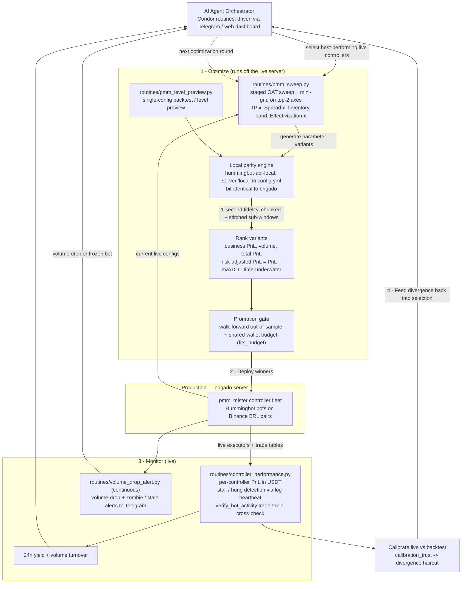

# AI Agent Market-Making Architecture

*Hummingbot Agent Cup submission — Condor*

This system runs a continuous optimize, deploy, and monitor loop for a fleet of Hummingbot `pmm_mister` market makers on Binance BRL pairs. An AI agent picks the best performing live controllers, generates parameter variants, and backtests them at one second fidelity on a local Hummingbot engine that is a byte for byte copy of the production server, so the heavy runs never touch live trading. The agent then ranks the variants by profit and volume, gates them on out of sample validation and available wallet budget, deploys the winners to the brigado production server, and watches them live for stalls and volume drops while comparing real fills against the backtest. What it learns from that comparison becomes a trust haircut that feeds the next round of optimization.

## The loop, step by step

1. **Optimize.** The agent takes the current live `pmm_mister` configs and, through `routines/pmm_sweep.py`, generates variants with a staged one-at-a-time sweep across TP, spread, inventory band, and effectivization axes, then a mini-grid on the two highest-impact axes. `routines/pmm_level_preview.py` covers single-config previews and backtests. Every backtest runs on the **local parity engine** (`hummingbot-api-local`, registered as server `local`), which is bit-identical to brigado. Fine 1-second runs are chunked into short back-to-back sub-windows (with a warmup overlap equal to the controller's effectivization time) and stitched back into one curve, because a long 1-second run on the single-threaded engine would otherwise freeze the whole API.

2. **Rank and gate.** Trials are ranked by business PnL (PnL plus maker rebates), volume, total PnL, and a risk-adjusted PnL that penalizes drawdown and time spent underwater and only credits rebates on fundable volume. Deploy candidates must clear a promotion gate: the edge has to survive an out-of-sample tail (walk-forward) and the set has to fit the shared wallet budget (`fits_budget`). The report emits copy-to-deploy YAML configs.

3. **Deploy.** Winning configs go to the `pmm_mister` fleet on the brigado production server.

4. **Monitor.** `routines/controller_performance.py` reports per-controller performance in USDT and detects stalls: the authoritative signal is the bot container's log heartbeat, so a controller that reports "running" but has gone silent is flagged as hung, and `verify_bot_activity` cross-checks the live trade table for real fills. `routines/volume_drop_alert.py` runs continuously and pings Telegram when a controller's volume drops below its running median or a bot goes stale. 24h yield and volume turnover round out the health picture.

5. **Calibrate and feed back.** Real fills are overlaid against the backtest and scored with `calibration_trust`; the divergence becomes a haircut that makes each next optimization round more predictive.
